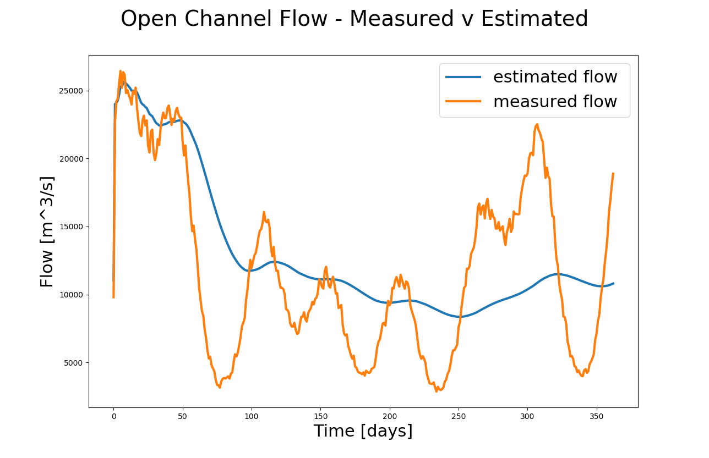

# Open Channel Flow - Kalman Filters
### Author: Callum DA Tyler
### Date: July 2020
## Overview
This package allows a user to simulate the flow of water through an open channel, filter the simulated data in a post-processing manner using either a mean-filter or a kalman-filter, then finally plot the results. It has been implemented in Python3 and Fortran. 

## Simulated data generation: 
Channel characteristics can be defined in `data_gen_params.py`. The data is generated by `data_gen.py`.
### Description
This script generates simulation data of a flow through an tropezoid shaped open channel. 
Water depth and speed would be measured from gauges. Channel width from
satellite images. Simulated height, water depth and speed data are then
saved to a csv file. Background noise is added to the simulated data using a sinusoid signal and a random number generator. Therefore, simulated data will vary each execution of `data_gen.py`.
### Definition: Open Channel Flow 
 Flow (Q) equals wetted area (WA) multiplied by water speed (WS)  
 Q = WA \* WS = WS \* (channel_width\*water_depth + 2\*sin(90-bank_angle)) [m^3/s]

 

### Assumptions:
 - Surface width dependant on  water height.
 - bank angle is measured from the horizon
 - Steady-State, Uniform Flow in open channel
 - Manning's roughness is concrete trowel finish

## Data filtering
Two types of filters have been implemented; 1) mean filter 2) kalman filter. Both filters have been implemented in such a way that they carry out "predict and update" steps. This allows noisy (background) data to be filtered and the true flow value to be extracted. Filter selection and uncertainities can be defined in `flow_parameters`. Filtered data is located in `data/ocf_flow_[curr/prev/meas].csv`.

## Data plotting
Example plots of generated data:
| Mean filter            |  Kalman filter |
:-------------------------:|:-------------------------:
  |  

## To use package:
1) Generate simulation data with:  
Set the simulation parameters in `data_gen_params.py`. 
Then run `python3 data_gen.py` to generate steady flow data. Data is saved in `data/ocf_data.csv`.
2) Run Kalman Filter with:
Set the filter parameters in `flow_parameters.txt` including uncertainties and the type of filter to use. 
Then run `./flow` to run either a mean filter or a kalman filter.
3) Plot results with: 
`python3 data_plot.py`